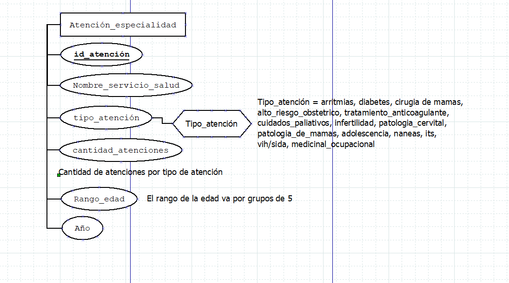

### REM - 07 Atención de especialidades
#### 1. Identificación de los datos
> **Fecha:** 2020 de enero a diciembre.  
> **Con todos los servicios de las especialidades de todo el país**.

> **Servicios de salud que salen:**  
- Arica  
- Iquique  
- Antofagasta  
- Atacama  
- Coquimbo  
- Valparaíso San Antonio  
- Viña del mar Quillota  
- Aconcagua  
- Metropolitano Norte  
- Metropolitano Occidente  
- Metropolitano Central
- Metropolitano Oriente  
- Metropolitano Sur  
- Metropolitano Sur Oriente  
- Libertador B.O'Higgins  
- Maule  
- Ñuble  
- Concepción  
- Arauco  
- Talcahuano  
- Biobío (pero no tiene registros)  
- Araucanía Norte  
- Araucania Sur  
- Valdivia  
- Osorno  
- Reloncaví  
- Chiloé  
- Aisén  
- Magallanes  

> **Tipos de atenciones que salen (no todos contienen los mismos)**  
- arritmias  
- diabetes  
- cirugía de mamas  
- alto riesgo obstetrico  
- tratamiento anticoagulante  
- cuidados paliativos  
- infertilidad  
- patologia cervical  
- patologia de mamas  
- adolescencia  
- naneas  
- its  
- vih/sida  
- medicinal ocupacional (salud del personal)  

> **Total de atenciones por cada tipo de atencion separados por cada servicio de salud:** integer que puede ser cero  

> **Edades por las que se separa**  
- 0 a 4 años  
- 5 a 9 años  
- 10 a 14 años  
- 15 a 19 años  
- 20 a 24 años  
- 25 a 29 años  
- 30 a 34 años  
- 35 a 39 años  
- 40 a 44 años  
- 45 a 49 años  
- 50 a 54 años  
- 55 a 59 años
- 60 a 64 años  
- 65 a 69 años  
- 70 a 74 años  
- 75 a 79 años  
- 80 a más años  

> **Hay una suma total de total por edad de cada una de las atenciones** integer que puede ser cero

> **Hay una suma total por tipo de atencion con cada una de las edades** integer que puede ser cero

#### Modelo entidad relación

