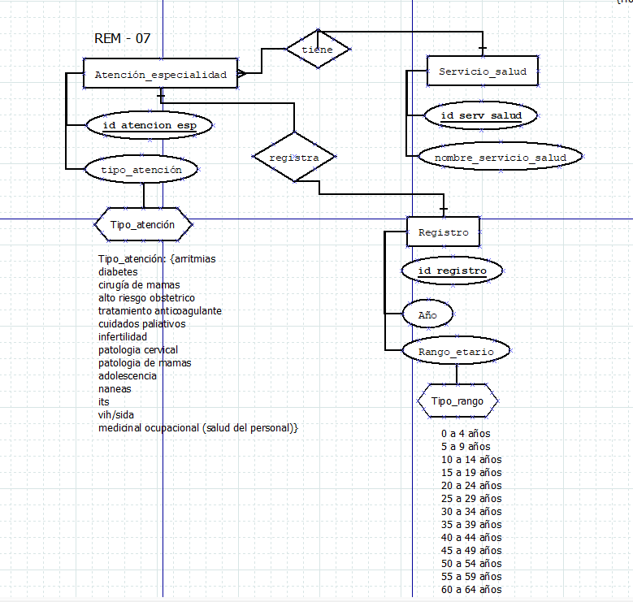
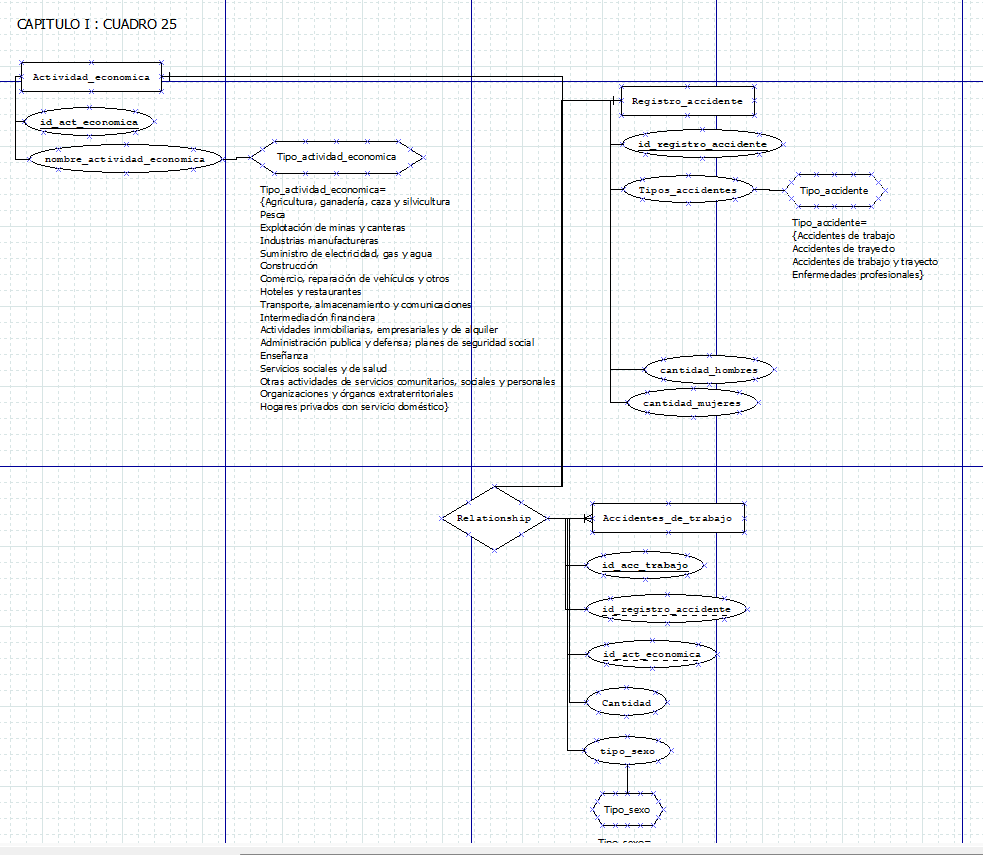
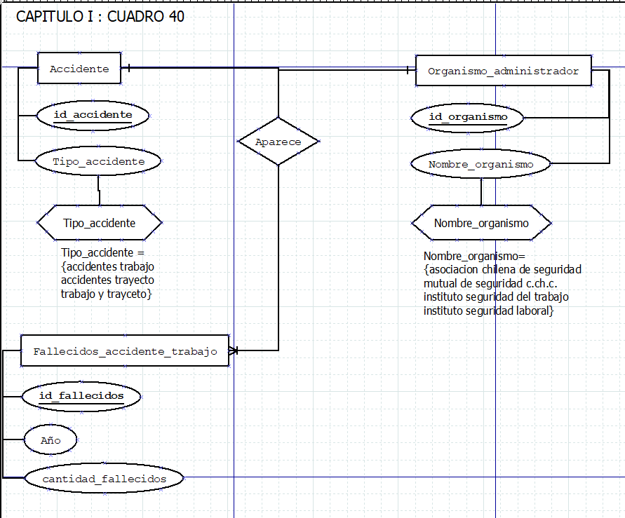

### REM - 07 Atención de especialidades
#### 1. Identificación de los datos
> **Fecha:** 2020 de enero a diciembre.  
> **Con todos los servicios de las especialidades de todo el país**.

> **Servicios de salud que salen:**  
- Arica  
- Iquique  
- Antofagasta  
- Atacama  
- Coquimbo  
- Valparaíso San Antonio  
- Viña del mar Quillota  
- Aconcagua  
- Metropolitano Norte  
- Metropolitano Occidente  
- Metropolitano Central
- Metropolitano Oriente  
- Metropolitano Sur  
- Metropolitano Sur Oriente  
- Libertador B.O'Higgins  
- Maule  
- Ñuble  
- Concepción  
- Arauco  
- Talcahuano  
- Biobío (pero no tiene registros)  
- Araucanía Norte  
- Araucania Sur  
- Valdivia  
- Osorno  
- Reloncaví  
- Chiloé  
- Aisén  
- Magallanes  

> **Tipos de atenciones que salen (no todos contienen los mismos)**  
- arritmias  
- diabetes  
- cirugía de mamas  
- alto riesgo obstetrico  
- tratamiento anticoagulante  
- cuidados paliativos  
- infertilidad  
- patologia cervical  
- patologia de mamas  
- adolescencia  
- naneas  
- its  
- vih/sida  
- medicinal ocupacional (salud del personal)  

> **Total de atenciones por cada tipo de atencion separados por cada servicio de salud:** integer que puede ser cero  

> **Edades por las que se separa**  
- 0 a 4 años  
- 5 a 9 años  
- 10 a 14 años  
- 15 a 19 años  
- 20 a 24 años  
- 25 a 29 años  
- 30 a 34 años  
- 35 a 39 años  
- 40 a 44 años  
- 45 a 49 años  
- 50 a 54 años  
- 55 a 59 años
- 60 a 64 años  
- 65 a 69 años  
- 70 a 74 años  
- 75 a 79 años  
- 80 a más años  

> **Hay una suma total de total por edad de cada una de las atenciones** integer que puede ser cero  
> **Hay una suma total por tipo de atencion con cada una de las edades** integer que puede ser cero  
#### Modelo entidad relación

### Resumen Estadístico Mensual (REM) por Establecimiento Salud REM-07. ATENCIÓN DE ESPECIALIDADES 2020 Servicios

### Capítulo I: (cuadro 25) SUCESO Estadísticas de la Seguridad Social 2024 NÚMERO DE ACCIDENTES DEL TRABAJO, DE TRAYECTO Y DE ENFERMEDADES PROFESIONALES SEGÚN ACTIVIDAD ECONÓMICA  
> NÚMERO DE ACCIDENTES DEL TRABAJO, DE TRAYECTO Y DE ENFERMEDADES PROFESIONALES SEGÚN ACTIVIDAD ECONÓMICA Y SEXO  
#### 1. Identificación de los datos
> **Actividades economicas que salen:**  
- Accidentes de trabajo  
- Accidentes de trayecto  
- Accidentes de trabajo y trayecto  
- Enfermedades profesionales  
> **Hombres:**  
cantidad de hombres por subtipo
> **Mujeres:**  
cantidad de mujeres por subtipo

> **Total por subtipo de actividad economica:**  
> **Tipos de trabajo:**  
- Agricultura, ganadería, caza y silvicultura
- Pesca
- Explotación de minas y canteras
- Industrias manufactureras
- Suministro de electricidad, gas y agua
- Construcción
- Comercio, reparación de vehículos y otros
- Hoteles y restaurantes
- Transporte, almacenamiento y comunicaciones
- Intermediación financiera
- Actividades inmobiliarias, empresariales y de alquiler
- Administración publica y defensa; planes de seguridad social
- Enseñanza
- Servicios sociales y de salud
- Otras actividades de servicios comunitarios, sociales y personales
- Organizaciones y órganos extraterritoriales
- Hogares privados con servicio doméstico
#### Modelo entidad relación

#### NÚMERO DE FALLECIDOS POR ACCIDENTES DEL TRABAJO SEGÚN TIPO DE ACCIDENTE Y ORGANISMO ADMINISTRADOR (1)
> **Tipo de accidente**  
- accidentes trabajo  
- accidentes trayecto  
- trabajo y trayceto  
> **Nombre de los organismos administradores**  
- asociacion chilena de seguridad
- mutual de seguridad c.ch.c.
- instituto seguridad del trabajo
- instituto seguridad laboral
> **Año**  
> **Totales**  
#### Modelo entidad relación

#### Empresas  
#### 1. Identificación de los datos  
Para los cuatro años 2020 a 2024 se tiene  
> **Tramo según ventas** integer que va desde 1 hasta 13  
> **Número de trabajadores dependientes**  integer que va desde cero  
> **Fecha inicio de actividades vigentes**  date  
> **Fecha termino de giro**  date  
> **Fecha primera inscripcion de ac**  date  
> **Tipo termino de giro**  text
- TERMINO DE GIRO PERSONA JURIDICA
- TERMINO GIRO SIMPLIFICADO RES. 41/2002
> **Tipo de contribuyente**
- SIN PER. JURIDICA
- PERSONA JURIDICA COMERCIAL
- ORG. SIN FINES DE LUCRO
- SOCIEDADES EXTRANJERAS
- ORGANISMOS INTERNACIONALES
- INSTITUCIONES FISCALES
- MUNICIPALIDADES
> **Subtipo de contribuyente**
- AGENCIA
- ASOC. GREMIAL
- CLUB DEPORTIVO
- COMUNIDADES DE EDIFICIOS
- COOPERATIVA
- CORPORACION
- CORPORACION EDUCACIONAL LEY 20845
- EMPR. INDIVIDUAL RESP. LTDA.
- ENTIDAD SIN RESIDENCIA
- FUNDACION
- JUNTA DE VECINOS, ORG. COMUNITARIA
- MINISTERIOS
- ORG. ADMINISTRACION PUBLICA
- ORG. MINISTERIO SALUD
- ORG. MINISTERIO DEFENSA
- ORG. MINISTERIO JUSTICIA
- ORGANISMOS INTERNACIONALES
- ORGANISMO AUTONOMO DEL ESTADO
- ORG. EDUCACION SUPERIOR
- OSTRA OSFL
- OTRAS ORGANIZACIONES SIN P. JURIDICA
- OTRO ESTABLECIMIENTO PERMANENTE
- OTRO ORG. MUNICIPAL
- PRESIDENCIA REGIONAL
- SINDICATO
- SOC. PLATAFORMA ART 41 D
- SOC. RESPONSABILIDAD LIMITADA
- SOCIEDA COLECTIVA CIVIL
- SOCIEDAD EXTRANJERA RES 5412/2000
- SOCIEDAD POR ACCIONES
- SOCIEDADES ANONIMAS ABIERTAS
- SOCIEDADES ANONIMAS CERRADAS
- SOCIEDADES DE HECHO
- SUCESIONES O COMUNIDADES HERED
- LICEO O COLEGIO MUNICIPAL
> **Tramo capital propio positivo**  
integer que va desde 1 a 10  
> **Tramo capital propio negativo**  
intger que va desde 1 a 10  
> **Rubro economico**   
> **Subrubro economico**  
> **Acitividad economico**  
> **Region** 
- XV REGION ARICA Y PARINACOTA
- I REGION TARAPACA
- II REGION ANTOFAGASTA
- III REGION ATACAMA
- IV REGION COQUIMBO
- V REGION VALPARAISO
- REGION METROPOLITANA DE SANTIAGO
- VI REGION DEL LIBERTADOR GENERAL BERNARDO O'HIGGINS
- VII REGION DEL MAULE
- XVI REGION DE ÑUBLE
- VIII REGION DEL BIOBIO
- IX REGION DE LA ARAUCANIA
- XIV REGION DE LOS RIOS
- X REGION DE LOS LAGOS
- XI REGION DE AYSEN DEL GENERAL CARLOS IBAÑEZ DEL CAMPO
- XII REGION DE MAGALLANES Y LA ANTARTICA CHILENA 
> **Provincia** 
- PROVINCIA DE ARICA
- PROVINCIA DE PARINACOTA
- PROVINCIA DE IQUIQUE
- PROVINCIA DEL TAMARUGAL
- PROVINCIA DE ANTOFAGASTA
- PROVINCIA DE EL LOA
- PROVINCIA DE TOCOPILLA
- PROVINCIA DE CHAÑARAL
- PROVINCIA DE COPIAPO
- PROVINCIA DE HUASCO
- PROVINCIA DE CHOAPA
- PROVINCIA DE ELQUI
- PROVINCIA DE LIMARI
- PROVINCIA DE ISLA DE PASCUA
- PROVINCIA DE LOS ANDES
- PROVINCIA DE PETORCA
- PROVINCIA DE QUILLOTA
- PROVINCIA DE SAN ANTONIO
- PROVINCIA DE SAN FELIPE DE ACONCAGUA
- PROVINCIA DE MARGA MARGA
- PROVINCIA DE VALPARAISO
- PROVINCIA DE CACHAPOAL
- PROVINCIA DE CARDENAL CARO
- PROVINCIA DE COLCHAGUA
- PROVINCIA DE CAUQUENES
- PROVINCIA DE CURICO
- PROVINCIA DE LINARES
- PROVINCIA DE TALCA
- PROVINCIA DE ARAUCO
- PROVINCIA DE BIOBIO
- PROVINCIA DE CONCEPCION
- PROVINCIA DE ITATA
- PROVINCIA DE DIGUILLIN
- PROVINCIA DE PUNILLA
- PROVINCIA DE CONCEPCION
- PROVINCIA DE MALLECO
- PROVINCIA DE CAUTIN
- PROVINCIA DE VALDIVIA
- PROVINCIA DEL RANCO
- PROVINCIA DE OSORNO
- PROVINCIA DE LLANQUIHUE
- PROVINCIA DE CHILOE
- PROVINCIA DE PALENA
- PROVINCIA DE COYHAIQUE
- PROVINCIA DE AYSEN
- PROVINCIA DE CAPITAN PRAT
- PROVINCIA DE GENERAL CARRERA
- PROVINCIA DE ULTIMA ESPERANZA
- PROVINCIA DE MAGALLANES
- PROVINCIA DE TIERRA DEL FUEGO
- PROVINCIA DE ANTARTICA CHILENA
- PROVINCIA DE CHACABUCO
- PROVINCIA DE CORDILLERA
- PROVINCIA DE MAIPO
- PROVINCIA DE MELIPILLA
- PROVINCIA DE SANTIAGO
- PROVINCIA DE TALAGANTE
> **Comuna**  
- ARICA
- CAMARONES
- GENERAL LAGOS
- PUTRE
- 
- ALTO HOSPICIO
- CAMIÑA
- COLCHANE
- HUARA
- IQUIQUE
- PICA
- POZO ALMONTE
- 
- ANTOFAGASTA
- CALAMA
- MARIA ELENA
- MEJILLONES
- OLLAGÜE
- SAN PEDRO DE ATACAMA
- SIERRA GORDA
- TALTAL
- TOCOPILLA
- 
- ALTO DEL CARMEN
- CALDERA
- CHAÑARAL
- COPIAPO
- DIEGO DE ALMAGRO
- FREIRINA
- HUASCO
- TIERRA AMARILLA
- VALLENAR
- 
- ANDACOLLO
- CANELA
- COMBARBALA
- COQUIMBO
- ILLAPEL
- LA HIGUERA
- LA SERENA
- LOS VILOS
- MONTE PATRIA
- OVALLE
- PAIGUANO
- PUNITAQUI
- RIO HURTADO
- SALAMANCA
- VICUÑA
- 
- ALGARROBO
- CABILDO
- CALERA
- CALLE LARGA
- CARTAGENA
- CASABLANCA
- CATEMU
- CONCON
- EL QUISCO
- EL TABO
- HIJUELAS
- ISLA DE PASCUA
- JUAN FERNANDEZ
- LA CRUZ
- LA LIGUA
- LIMACHE
- LLAILLAY
- LOS ANDES
- NOGALES
- OLMUE
- PANQUEHUE
- PAPUDO
- PETORCA
- PUCHUNCAVI
- PUTAENDO
- QUILLOTA
- QUILPUE
- QUINTERO
- RINCONADA
- SAN ANTONIO
- SAN ESTEBAN
- SAN FELIPE
- SANTA MARIA
- SANTO DOMINGO
- VALPARAISO
- VILLA ALEMANA
- VIÑA DEL MAR
- ZAPALLAR
- 
- ALHUE
- BUIN
- CALERA DE TANGO
- CERRILLOS
- CERRO NAVIA
- COLINA
- CONCHALI
- CURACAVI
- EL BOSQUE
- EL MONTE
- ESTACION CENTRAL
- HUECHURABA
- INDEPENDENCIA
- ISLA DE MAIPO
- LA CISTERNA
- LA FLORIDA
- LA GRANJA
- LA PINTANA
- LA REINA
- LAMPA
- LAS CONDES
- LO BARNECHEA
- LO ESPEJO
- LO PRADO
- MACUL
- MAIPU
- MARIA PINTO
- MELIPILLA
- ÑUÑOA
- PADRE HURTADO
- PAINE
- PEDRO AGUIRRE CERDA
- PEÑAFLOR
- PEÑALOLEN
- PIRQUE
- PROVIDENCIA
- PUDAHUEL
- PUENTE ALTO
- QUILICURA
- QUINTA NORMAL
- RECOLETA
- RENCA
- SAN BERNARDO
- SAN JOAQUIN
- SAN JOSE DE MAIPO
- SAN MIGUEL
- SAN PEDRO
- SAN RAMON
- SANTIAGO
- TALAGANTE
- TILTIL
- VITACURA
- 
- CHEPICA
- CHIMBARONGO
- CODEGUA
- COINCO
- COLTAUCO
- DOÑIHUE
- GRANEROS
- LA ESTRELLA
- LAS CABRAS
- LITUECHE
- LOLOL
- MACHALI
- MALLOA
- MARCHIGÜE
- MOSTAZAL
- NANCAGUA
- NAVIDAD
- OLIVAR
- PALMILLA
- PAREDONES
- PERALILLO
- PEUMO
- PICHIDEGUA
- PICHILEMU
- PLACILLA
- PUMANQUE
- QUINTA DE TILCOCO
- RANCAGUA
- RENGO
- REQUINOA
- SAN FERNANDO
- SAN VICENTE
- SANTA CRUZ
- 
- CAUQUENES
- CHANCO
- COLBUN
- CONSTITUCION
- CUREPTO
- CURICO
- EMPEDRADO
- HUALAÑE
- LICANTEN
- LINARES
- LONGAVI
- MAULE
- MOLINA
- PARRAL
- PELARCO
- PELLUHUE
- PENCAHUE
- RAUCO
- RETIRO
- RIO CLARO
- ROMERAL
- SAGRADA FAMILIA
- SAN CLEMENTE
- SAN JAVIER
- SAN RAFAEL
- TALCA
- TENO
- VICHUQUEN
- VILLA ALEGRE
- YERBAS BUENAS
- 
- BULNES
- CHILLAN
- CHILLAN VIEJO
- COBQUECURA
- COELEMU
- COIHUECO
- EL CARMEN
- NINHUE
- ÑIQUEN
- PEMUCO
- PINTO
- PORTEZUELO
- QUILLON
- QUIRIHUE
- RANQUIL
- SAN CARLOS
- SAN FABIAN
- SAN IGNACIO
- SAN NICOLAS
- TREHUACO
- YUNGAY
- 
- ALTO BIOBIO
- ANTUCO
- ARAUCO
- CABRERO
- CAÑETE
- CHIGUAYANTE
- CONCEPCION
- CONTULMO
- CORONEL
- CURANILAHUE
- FLORIDA
- HUALPEN
- HUALQUI
- LAJA
- LEBU
- LOS ALAMOS
- LOS ANGELES
- LOTA
- MULCHEN
- NACIMIENTO
- NEGRETE
- PENCO
- QUILACO
- QUILLECO
- SAN PEDRO DE LA PAZ
- SAN ROSENDO
- SANTA BARBARA
- SANTA JUANA
- TALCAHUANO
- TIRUA
- TOME
- TUCAPEL
- YUMBEL
- 
- ANGOL
- CARAHUE
- CHOLCHOL
- COLLIPULLI
- CUNCO
- CURACAUTIN
- CURARREHUE
- ERCILLA
- FREIRE
- GALVARINO
- GORBEA
- LAUTARO
- LONCOCHE
- LONQUIMAY
- LOS SAUCES
- LUMACO
- MELIPEUCO
- NUEVA IMPERIAL
- PADRE LAS CASAS
- PERQUENCO
- PITRUFQUEN
- PUCON
- PUREN
- RENAICO
- SAAVEDRA
- TEMUCO
- TEODORO SCHMIDT
- TOLTEN
- TRAIGUEN
- VICTORIA
- VILCUN
- VILLARRICA
- 
- CORRAL
- FUTRONO
- LA UNION
- LAGO RANCO
- LANCO
- LOS LAGOS
- MAFIL
- MARIQUINA
- PAILLACO
- PANGUIPULLI
- RIO BUENO
- VALDIVIA
- 
- ANCUD
- CALBUCO
- CASTRO
- CHAITEN
- CHONCHI
- COCHAMO
- CURACO DE VELEZ
- DALCAHUE
- FRESIA
- FRUTILLAR
- FUTALEUFU
- HUALAIHUE
- LLANQUIHUE
- LOS MUERMOS
- MAULLIN
- OSORNO
- PALENA
- PUERTO MONTT
- PUERTO OCTAY
- PUERTO VARAS
- PUQUELDON
- PURRANQUE
- PUYEHUE
- QUEILEN
- QUELLON
- QUEMCHI
- QUINCHAO
- RIO NEGRO
- SAN JUAN DE LA COSTA
- SAN PABLO
- 
- AISEN
- CHILE CHICO
- CISNES
- COCHRANE
- COYHAIQUE
- GUAITECAS
- LAGO VERDE
- O'HIGGINS
- RIO IBAÑEZ
- TORTEL
- 
- ANTARTICA
- CABO DE HORNOS
- LAGUNA BLANCA
- NATALES
- PORVENIR
- PRIMAVERA
- PUNTA ARENAS
- RIO VERDE
- SAN GREGORIO
- TIMAUKEL
- TORRES DEL PAINE   
> **R_presunta**  
- REGIMEN RENTA PRESUNTA 
> **Otros regimenes**    
- REGIMEN GENERAL SEMI INTEGRADO (14A)
- REGIMEN PRO PYME GENERAL (14D)
- REGIMEN PRO PYME TRANSPARENTE (14D N°8)
- CONTRIBUYENTES NO SUJETOS AL ARTICULO 14